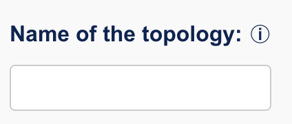
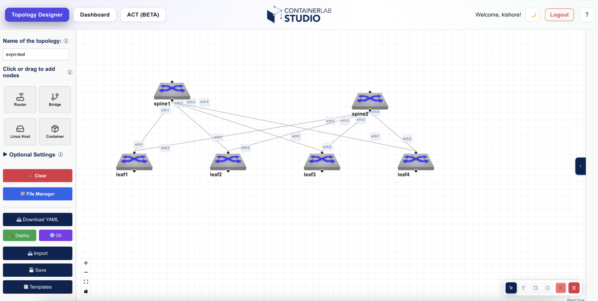
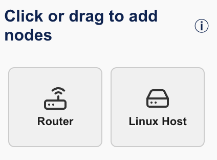
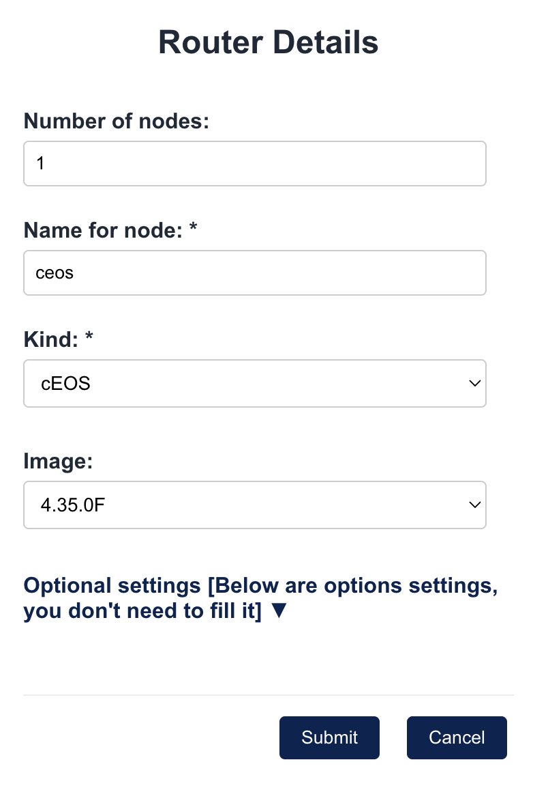
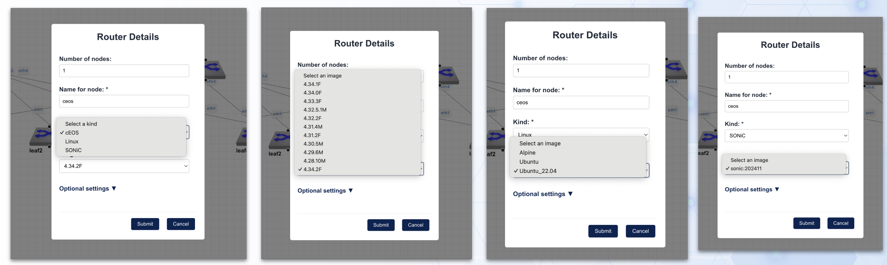
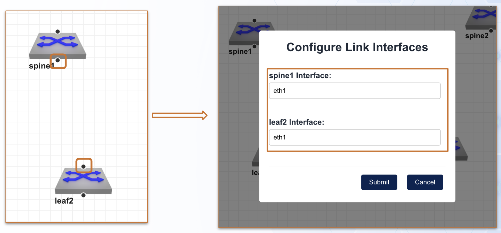

# Topology Designer

This guide explains how to use the Topology Designer in **containerlab studio**.

The Topology Designer allows you to visually create and configure network topologies for your containerlab environments.

To get to this page click on the Topology Designer tab in the Navbar.

## Interface Overview

The different options in this Topology designer page are explained below:

### Name of the topology

A unique name for your topology. While you deploy the lab, this topology name gets prepended with the username. Eg. If topolgy name is set to mlag, then while I deploy it gets changes to kishore-mlag where kishore is the logged in UI username.

### Design Area

There is grid area in the middle where you can drag and drop nodes to create network topologies. The Design area also has annotation tools for use.

### Click or drag to add nodes

{width=400px height=200px}

Use these available node type tile to either click on it OR click and drag it in the design area to open up the router details modal to fill in the node details. 

#### Router Details

{width=400px height=200px}

1. **Number of Nodes**: Enter the number of nodes to be created in the design area
2. **Name for nodes**: Enter the name to be used as prefix for the nodes. For eg. if "leaf" is entered and number of nodes is 10, this will create leaf1 through leaf10 in the design area
3. **Kind**: Kind of node. Eg. cEOS, Linux
4. **Image**: Specific version of the kind used

#### Kind & Images

#### Optionals in Router details

{width=400px height=200px}

1. **Binds**: 
2. **Startup Configs**: 
3. **Management IP**: 

### Configure Links & Connections

## Key Features

- **Visual drag-and-drop interface**: Easily add and connect network devices
- **Device library**: Access to pre-configured device types
- **Connection management**: Define links between devices
- **Configuration export**: Generate containerlab YAML files

## Working with Devices

### Adding Devices

[Placeholder for adding devices instructions]

### Configuring Device Properties

[Placeholder for device configuration instructions]

### Connecting Devices

[Placeholder for connection instructions]

## Exporting Topologies

Learn how to export your designed topology to containerlab format.

[Placeholder for export instructions]

## Best Practices

!!! tip "Design Tip"
    Start with a simple topology and gradually add complexity as needed.

!!! warning "Performance Note"
    Large topologies with many devices may require additional system resources.

## Troubleshooting

### Common Issues

**Issue**: [Placeholder issue description]

**Solution**: [Placeholder solution]

## Related Guides

- [Getting Started](../getting-started.md)
- [Login Guide](login-guide.md)

## Next Steps

After mastering the Topology Designer, you can:

1. Explore advanced topology patterns
2. Learn about device configuration management
3. Deploy your topologies to production environments
